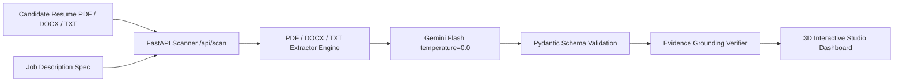

# 🚀 MATCH.AI — AI Resume Screener & Feedback System

[](https://github.com/majidali1256/ai-resume-screener)
[](https://huggingface.co/majidali1256/AI_Resume_Scanner)
[](https://huggingface.co/spaces/majidali1256/AI-Resume-Screener-Studio)
[](https://fastapi.tiangolo.com)
[](https://ai.google.dev)

**Project 1 — AI & Generative AI Fellowship Program @ Zeppelin Lab**

An enterprise-grade, deterministic **AI Resume Screener & Structured Feedback System** built for high-accuracy recruitment screening. Powered by **Google Gemini Flash**, strictly typed with **Pydantic**, served via **FastAPI**, and styled with a **3D Glassmorphism Executive Studio Dashboard**.

---

## 📋 Project Overview

MATCH.AI is an AI-powered resume screening system that:
- Accepts candidate resumes (PDF, DOCX, TXT) and job descriptions
- Uses Google Gemini Flash AI to perform structured, deterministic evaluations
- Returns validated JSON assessments with match scores, matched/missing requirements, and actionable suggestions
- Includes an **Evidence Grounding Verifier** to prevent AI hallucinations
- Features a premium 3D interactive web dashboard with dark/light themes

---

## 🛠️ Tech Stack

| Layer | Technology |
|---|---|
| **Language** | Python 3.10+ |
| **Backend Framework** | FastAPI + Uvicorn |
| **AI/LLM Engine** | Google Gemini Flash (REST API) |
| **Schema Validation** | Pydantic AI (Structured JSON Output) |
| **Frontend** | HTML5, CSS3, Vanilla JavaScript (3D Glassmorphism UI) |
| **Gradio Interface** | Gradio 5.12.0 (Hugging Face Spaces deployment) |
| **PDF Extraction** | PyPDF2 |
| **DOCX Extraction** | python-docx |
| **Testing** | Pytest (5/5 automated tests) |
| **CI/CD** | GitHub Actions |
| **Deployment** | Hugging Face Spaces, Docker |
| **Version Control** | Git + GitHub (branching: main, dev, feature/*) |

---

## ✨ Features & Architecture



1. **Deterministic AI Scoring Engine (`temperature = 0.0`)**: Evaluates candidates against job descriptions without LLM hallucinations or variance.
2. **Strict Pydantic Output Validation**: Enforces valid JSON structure (`Assessment` schema) with scores (0–100), rationale, matched requirements, skill gaps, and suggestions.
3. **Evidence Grounding Verifier**: Token-based semantic overlap analysis to verify every AI claim against actual resume text.
4. **3D Glassmorphism Executive Dashboard**: Dual Aurora Light & Obsidian Dark Themes, 3D particle canvas, perspective mouse tilt effects.
5. **Multi-Format Document Support**: Supports `.pdf`, `.docx`, `.doc`, and `.txt` files.

---

## 🚀 Setup Steps

### Prerequisites
- Python 3.10 or higher
- Git
- A Google Gemini API Key ([Get one free](https://aistudio.google.com/app/apikey))

### 1. Clone the Repository
```bash
git clone https://github.com/majidali1256/ai-resume-screener.git
cd ai-resume-screener
```

### 2. Create Virtual Environment & Install Dependencies
```bash
python3 -m venv .venv
source .venv/bin/activate
pip install -r requirements.txt
```

### 3. Configure Environment Variables
```bash
cp .env.example .env
# Edit .env and add your Gemini API Key:
# GEMINI_API_KEY=your_api_key_here
# AI_MODEL=gemini-2.0-flash
```

> ⚠️ **Security Note:** `.env` is excluded from version control via `.gitignore`. Never commit API keys.

### 4. Run the Server
```bash
uvicorn main:app --host 0.0.0.0 --port 8000
```
Open **[http://localhost:8000](http://localhost:8000)** to launch the 3D Executive Studio Dashboard!

### 5. Run Tests
```bash
pytest tests/
```

---

## 🔌 API Reference

### `POST /api/scan`
Upload a candidate resume and job description to get a complete JSON assessment.

**Request (Multipart Form Data):**
- `resume_file`: `.pdf`, `.docx`, `.doc`, or `.txt` file
- `jd_file` (optional): Job Description file
- `jd_text` (optional): Raw job description text

**Response Schema:**
```json
{
  "match_score": 85,
  "score_rationale": "Strong alignment across Python, FastAPI, and React...",
  "matched_requirements": ["5+ years Python experience", "FastAPI expertise"],
  "missing_requirements": ["GraphQL experience"],
  "suggestions": ["Quantify accomplishments with specific metrics"],
  "limitations": []
}
```

### `GET /api/health`
Returns service health status.

### `GET /api/demo`
Runs a sample scan using built-in benchmark data.

---

## 📁 Project Structure

```
ai-resume-screener/
├── main.py                    # FastAPI server entry point
├── app.py                     # Gradio interface (Hugging Face Spaces)
├── resume_scanner/
│   ├── assessor.py            # Gemini Flash AI assessment engine
│   ├── extractor.py           # PDF/DOCX/TXT text extraction
│   ├── grounding.py           # Evidence grounding verifier
│   └── models.py              # Pydantic Assessment schema
├── static/
│   └── index.html             # 3D Glassmorphism Executive Dashboard
├── data/
│   ├── benchmark/             # Golden evaluation benchmark library
│   └── uploads/               # Temporary upload storage (gitignored)
├── tests/
│   └── test_screener.py       # Automated pytest suite
├── .github/
│   └── workflows/ci.yml       # GitHub Actions CI pipeline
├── requirements.txt           # Python dependencies
├── Dockerfile                 # Docker deployment config
├── .env.example               # Environment variable template
├── .gitignore                 # Security: excludes .env, uploads, caches
└── README.md                  # This file
```

---

## 🔒 Security & Privacy

- **API keys** are stored in `.env` (never committed — excluded by `.gitignore`)
- **Uploaded resumes** are processed in-memory and cleaned up immediately after scanning
- **No PII storage**: The system does not persist any candidate personal data

---

## 🌐 Live Deployment

| Platform | Link |
|---|---|
| **Live Demo (Hugging Face Space)** | [AI-Resume-Screener-Studio](https://huggingface.co/spaces/majidali1256/AI-Resume-Screener-Studio) |
| **GitHub Repository** | [ai-resume-screener](https://github.com/majidali1256/ai-resume-screener) |
| **Hugging Face Model Card** | [AI_Resume_Scanner](https://huggingface.co/majidali1256/AI_Resume_Scanner) |

---

## 👨‍💻 Team & Roles

| Role | Name | GitHub |
|---|---|---|
| **Project Lead & Full-Stack Developer** | Majid Ali | [@majidali1256](https://github.com/majidali1256) |

**Responsibilities:**
- AI/LLM Engine Development (Gemini Flash integration, structured prompting)
- Backend Architecture (FastAPI REST API, Pydantic validation)
- Frontend Development (3D Glassmorphism Dashboard, Gradio interface)
- Evidence Grounding Verifier module
- Testing & CI/CD (Pytest suite, GitHub Actions)
- Deployment (Hugging Face Spaces, Docker)

---

## 📄 License

This project is licensed under the MIT License.
