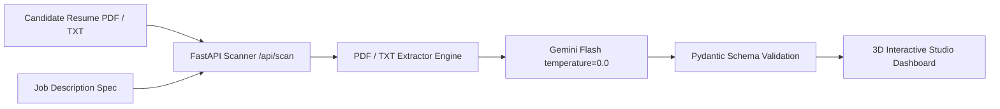

# 🚀 MATCH.AI — AI Resume Screener & Feedback System

[](https://github.com/majidali1256/ai-resume-screener)
[](https://huggingface.co/majidali1256/AI_Resume_Scanner)
[](https://fastapi.tiangolo.com)
[](https://ai.google.dev)

An enterprise-grade, deterministic **AI Resume Screener & Structured Feedback System** built for high-accuracy recruitment screening. Powered by **Google Gemini Flash**, strictly typed with **Pydantic**, served via **FastAPI**, and styled with **Google Stitch MCP 3D Executive Studio**.

---

## ✨ Features & Architecture



1. **Deterministic AI Scoring Engine (`temperature = 0.0`)**:
   - Evaluates candidates against job descriptions without LLM hallucinations or variance.
2. **Strict Pydantic Output Validation**:
   - Enforces valid JSON structure (`Assessment` schema) with numerical scores (0–100), executive rationale, matched requirements, skill gaps, and interview presentation suggestions.
3. **Google Stitch MCP 3D Executive Studio (`static/index.html`)**:
   - **Dual Aurora Light & Obsidian Dark Themes** with automatic local persistence.
   - **3D Interactive Particle Network Canvas**: Dynamic depth-scaled nodes floating and connecting at 60 FPS.
   - **3D Perspective Mouse Tilt**: Glassmorphic cards tilt realistically in 3D space with specular lighting.
4. **Isolated & Safe Document Processing**:
   - Supports both `.pdf` and `.txt` documents without storing sensitive applicant files.

---

## 🚀 Quick Setup & Usage

### 1. Run Locally with Docker
```bash
docker build -t ai-resume-scanner .
docker run -p 8000:8000 -e GEMINI_API_KEY="your_api_key_here" ai-resume-scanner
```

### 2. Run Locally with Python Virtual Environment
```bash
python3 -m venv .venv
source .venv/bin/activate
pip install -r requirements.txt

# Set your Gemini API Key
export GEMINI_API_KEY="your_api_key_here"

# Start the server
uvicorn main:app --host 0.0.0.0 --port 8000
```
Open your browser at **[http://localhost:8000](http://localhost:8000)** to launch the **3D Executive Studio**!

---

## 🔌 API Reference

### POST `/api/scan`
Upload a candidate resume and job description to get a complete JSON assessment.

#### Request (Multipart Form Data):
- `resume_file`: `.pdf` or `.txt` file
- `jd_file` (optional): Job Description `.pdf` or `.txt` file
- `jd_text` (optional): Raw job description text

#### Response Schema:
```json
{
  "match_score": 85,
  "score_rationale": "Strong alignment across React, TypeScript, and modern frontend architecture...",
  "matched_requirements": [
    "5+ years Frontend engineering experience",
    "Expertise in TypeScript and React 18"
  ],
  "missing_requirements": [
    "Direct experience with GraphQL caching layer"
  ],
  "suggestions": [
    "Highlight quantifiable performance metrics in recent roles"
  ],
  "limitations": []
}
```

---

## 👨‍💻 Author & Team
- **Team Lead & Creator:** [Majid Ali](https://github.com/majidali1256)
- **Repository:** `majidali1256/ai-resume-screener`
